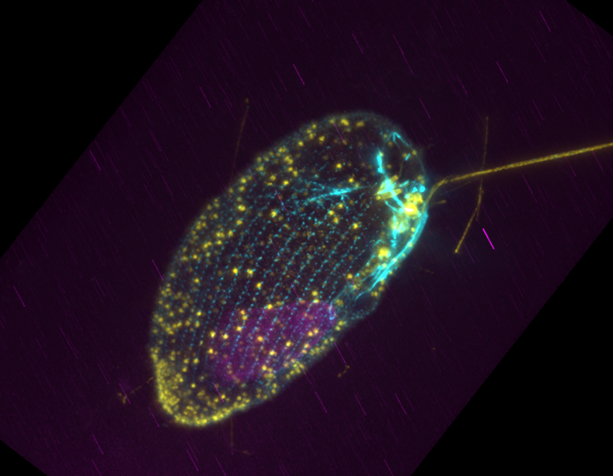
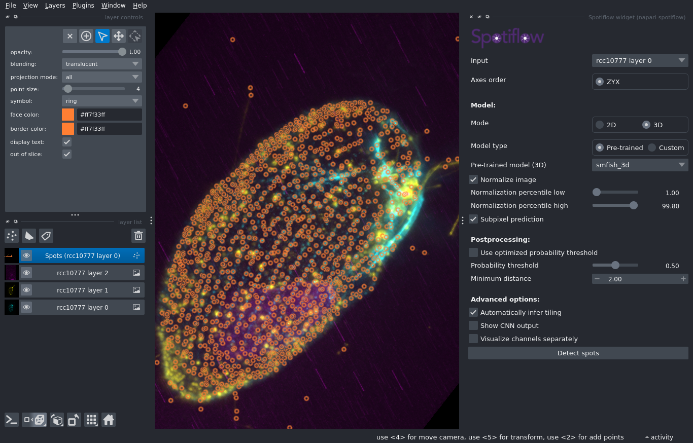
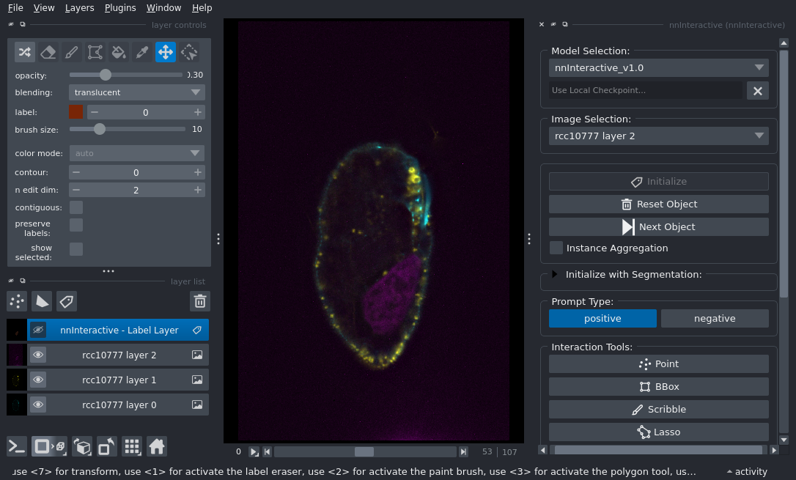
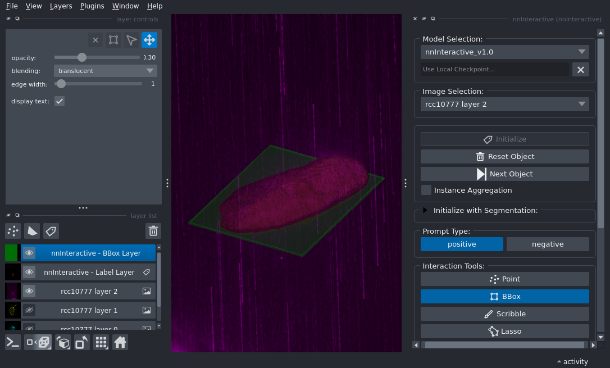

# Spotiflow + nnInteract Example

This example demonstrates how to use Spotiflow and nnInteract to segment different types of features in a 3D microscopy image. Both methods are made user-friendly as napari plugins. As a final step we also create a short animation showing the dataset and the segmented features using one more napari plugin called napari-animation. 

## Dataset 

The dataset used in this example is a 3D multi-channel fluorescence image of a microbial eukaryote imaged using Ultrastructural Expansion Microscopy (U-ExM)[^1], specifically a xxx (find the original file [here](https://app.globus.org/file-manager?origin_id=47772002-3e5b-4fd3-b97c-18cee38d6df2&origin_path=%2Fbiostudies%2Ffire%2FS-BIAD%2F095%2FS-BIAD2095%2FFiles%2Fculture_collection_zips%2F)). Here we use a dataset labelled using immunofluorescence to highlight microtubules, DNA and centrin (associated with centrioles). An example is shown below. As is visible, DNA (yellow) forms a sort of a blob, and both microtubules (magenta) and centrin (cyan) appear as dot-like structures. The goal of this example is to segment these three features using Spotiflow and nnInteract.

 

To start, make sure you locate the data which are saved in the Research Storage partition of the VIBE project. Open a File Browser (third icon from left in bottom tools bar). Then go to the File System and browse to `/storage/research/dsl_vibe_rs/demo_data /MIC_summer_school_2026/napari_dataset/rcc10777.tif`. You can drag and drop e.g. the `MIC_summer_school_2026` folder to the left panel of the File Browser to create a shortcut for easier access.

## Visualize

 To visualize the dataset, you can use napari. To do so, go to the Applications menu at the top left of the window and navigate to **VIBE -> VIBE applications -> napari**, then click on the **napari-spotiflow-0.4.4** application. This will launch napari. A terminal window will appear, indicating that the application is starting. Wait a few seconds until the napari graphical user interface (GUI) opens. 
 
 Now you can drag and drop the tif file on th viewer (blank black area). When prompted to choose a Reader, use `napari builtins`. You should now have a **layer** called `rcc10777` in the layer list on the left of the viewer. To clearly see the three channels, right-click on the layer `rcc10777` and select `Split Stack`. This will transform that layer into three separate layers.

 You can now turn layers on/off (eye symbol), modify the look of each layer using the options in the layer controls (above layer list), zoom in/out using the mouse wheel, move the dataset by click and drag, and move through the z-stack using the slider at the bottom of the viewer. Finally you can find a set of buttons at the bottom left of the viewer. You can use the second one (Toggle 2d/3d view) to switch between 2D and 3D view. In 3D view you can rotate the dataset by click and drag, and zoom in/out using the mouse wheel.

## Spot detection using Spotiflow

Our first goal is now to see if we manage to detect the spots formed by the centrin labelling (cyan channel, layer 0). To do so we will use Spotiflow[^2], a deep learning model trained to detect spot-like features in microscopy data. Spotiflow comes with a few pre-trained models both for 2D and 3D data. In this example we will just use one of those models, but in a real case, you would probably want to fine-tune your own model.

Spotiflow is available as a user-friendly plugin that comes pre-installed on VIBE. To launch it, go to the Plugins menu at the top of the napari window and click on **Spotiflow widget**. This will add a panel on the right of the viewer. Use the same settings as shown in the screenshot below: select the layer 0, set to 3D mode, probability threshold to 0.5 (untick the optimized solution). Then click on `Detect Spots`. A new layer with spots should appear. You can select all points in the layer using the `Select Points` button (top left) and then edit their look, especially the point size.

 

You can now browse through the segmentation either in 3D or 2D mode. Finally, select the spots layer and got to `File -> Save Select Layer(s)` and save the CSV file with coordinates somewhere in your project folder.

Finally, close the application. You should be able to re-open it, drag and drop the dataset again as well as the CSV file to visualize your result.

## DNA blob detection using nnInteractive

The DNA highlight resembles a blob-like structure (yellow channel, layer 1). While one might be able to segment it using a simple thresholding approach, we will use here a deep learning-based annotation method: we will guide a model in segmenting the appropriate region. For this we use the nnInteractive method[^3] also implemented as a plugin in napari. To launch it, got the Applications menu at the top left of the window and navigate to **VIBE -> VIBE applications -> napari**, then click on the **napari-nnInteractive-1.0.6** application. This will launch napari. Open the dataset in the same way as before (make sure to use napari builtins for opening). Then head to the Plugins menu and pick `nnInteractive`. Again, this will add a panel on the right of the viewer.

We want to segment layer 2 (magenta). So we select it in `Image Selection`. Then we need to process the layer so that it becomes possible to "prompt it". This is achieved by clicking on `Initialize` and takes a few second. After that, you should see the state shown below.

You have additional buttons that you can now use for prompting. You can indicate the object to segment by adding points, drawing scribbles or adding a box. In this example we use a box via the ``BBox`` button. Once you click you now have an additional layer called `nnInteractive - BBox Layer`. You can select the layer and then draw a box around the magenta shape. **The drawing happens in 2D but as soon as the shape is added, segmentation is done in 3D**. You can now look at the segmentation in 3D!

You can now save the segmentation by selecting the `nnInteractive - Label Layer` layer and going to `File -> Save Select Layer(s)` and save as a tif file.

## Combine and visualize

In this last step we are going to combined the two segmentations and create a nice animation to present the result. For this we now open the base napari application (VIBE -> VIBE applications -> napari -> napari-base-0.7.) which includes a series of plugins such as napari-animation to create animations.

Open the dataset as before. Then drag and drop the segmentation tif file and the CSV spot detection file as well (always with napari builtins Reader). In the end you should have 5 layers: three for the imaging data, one for teh segmentation and one for the spots. You can adjust the rendering first. For example set the transparency level of the segmentation, adjust the spots size and color etc.

Once this is done open the animation plugin by going to `Plugins -> wizard (napari-animation)`. This will add a panel on the right of the viewer. You can now modify the rendering to a given state and then "save" it as a keyframe using `Capture` then change the rendering again and select another keyframe etc. The plugin will then create a smooth animation between these keyframes. You can pre-visualize this using the slider at the bottom of the panel. Finally you can export the animation as a video file using `Save Animation`. You can select the output format and the frame rate. Try to create a nice animation, just showing the dataset, the turning on separately the segmentation, zooming, rotating etc.

<video controls loop muted autoplay>
 <source src="../assets/videos/rcc10777_animation.webm" type="video/webm">
</video>

[^1]: Felix Mikus, Armando Rubio Ramos, Hiral Shah, Jonas Hellgoth, Marine Olivetta, Susanne Borgers, Clémence Saint-Donat, Margarida Araújo, Chandni Bhickta, Paulina Cherek, Jone Bilbao, Estibalitz Txurruka, Yana Egli, Nikolaus Leisch, Yannick Schwab, Filip Husnik, Sergio Seoane, Ian Probert, Paul Guichard, Virginie Hamel, Gautam Dey & Omaya Dudin (2025). Image data set for "Charting the landscape of cytoskeletal diversity in microbial eukaryotes". BioStudies, S-BIAD2095. Retrieved from https://www.ebi.ac.uk/biostudies/bioimages/studies/S-BIAD2095

[^2]: Dominguez Mantes, A., Herrera, A., Khven, I. et al. Spotiflow: accurate and efficient spot detection for fluorescence microscopy with deep stereographic flow regression. Nat Methods 22, 1495–1504 (2025). https://doi.org/10.1038/s41592-025-02662-x

[^3]: Isensee, F., Rokuss, M., Krämer, L., Dinkelacker, S., Ravindran, A., Stritzke, F., Hamm, B., Wald, T., Langenberg, M., Ulrich, C., Deissler, J., Floca, R., & Maier-Hein, K. (2025). nnInteractive: Redefining 3D Promptable Segmentation. https://arxiv.org/abs/2503.08373