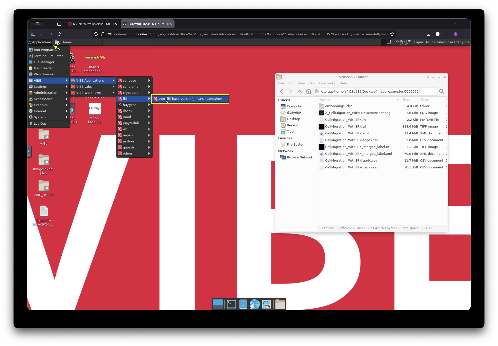
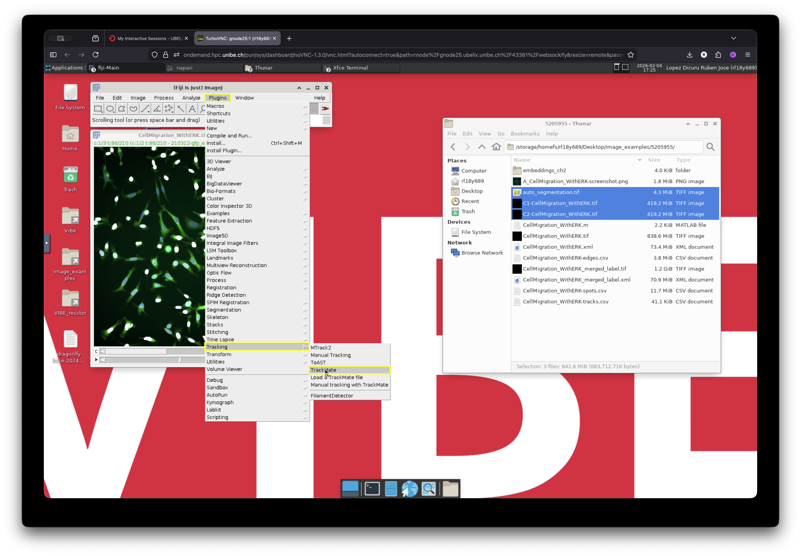

# Cell Segmentation and Tracking 

## Overview

In this example, we demonstrate how to use **microSAM**[^1] in napari in combination with the **TrackMate**[^2] Fiji plugin to track cell migration. The dataset consists of time-lapse fluorescence images of MDA-MB-231 cells expressing an ERK activity reporter, acquired using a widefield fluorescence microscope[^3].

We use the DAPI staining channel as a reference for cell tracking. microSAM is used to segment the cell nuclei, and the resulting labeled nuclei are then used as input for tracking cell trajectories with TrackMate in Fiji. Between these steps, several preprocessing operations are performed, including splitting and merging image channels.

If you want to skip the tutorial and just look at the full demostration video, feel free to jump to the [Full Workflow](#full-workflow) section.

## Visualize and Split Channels

We will first launch Fiji to visualize and split the image channels. 

Go to the Applications menu at the top left of the window and navigate to **VIBE -> VIBE applications -> fiji**, then click on the **Fiji-base** application. This will launch Fiji. A terminal window will appear, indicating that the application is starting. Wait a few seconds until the Fiji graphical user interface (GUI) opens.

 

The image we will use is located in a folder on the desktop of the current session. Drag and drop the image into Fiji to visualize it.

<video controls loop muted autoplay>
 <source src="../assets/videos/display_cells_in_motion.webm" type="video/webm">
</video>

In Fiji, go to **Image -> Color -> Split Channels** to separate the channels. Save each channel as a separate file. In the next step, we will use the channel containing the nuclei staining (DAPI) for segmentation.

## Launch napari and microSAM

- Next, open napari and use the napari-microSAM plugin to segment the nuclei.
- Navigate again to the Applications menu: **VIBE -> VIBE applications -> napari**, and click on **napari-microSAM-1.6.2**.
- Open the image containing the stained nuclei (DAPI channel). Then launch the plugin by going to:
**Plugins -> Segment Anything for Microscopy -> Annotator 3D**

## Adjust Settings and Segment the Cells

microSAM provides several parameters that can be adjusted for optimal segmentation. In addition, it must compute image embeddings before generating predictions.

For this example, we will use the default settings, which provide acceptable results for this dataset. You are encouraged to explore additional parameters for your own data. Detailed explanations of all settings can be found in the official [microSAM documentation](https://computational-cell-analytics.github.io/micro-sam/micro_sam.html).

Let us configure the basic settings required for segmentation:

- **Select the image layer to segment.**  
  In our case, this is selected by default because only one image layer is open.

- **Select the model:**  
  Choose **"Light Microscopy"**.

- **Compute embeddings:**  
  Open the **"Embeddings Settings"** menu and configure the following:
  - **Model size:** "base"
  - **Device:** cuda
  - Click **"Compute Embeddings"** and wait until the computation finishes.

 

After configuring the basic settings, open the automatic segmentation menu, select **"Apply to Volume"**, and then click **"Automatic Segmentation"**.

This step may take a few minutes. You can monitor the progress using the activity bar located at the bottom right corner of the napari window.

<video controls loop muted autoplay>
 <source src="../assets/videos/segmentation_progress.webm" type="video/webm">
</video>

## Merge the Annotation Labels with the Image

Save the layer named **"auto_segmentation"**. This file contains the segmentation mask that we will use in the next step with TrackMate.

Open Fiji and load:

- The individual channels saved earlier  
- The segmentation mask generated by microSAM  

In Fiji, combine the images by navigating to:
**Image -> Color -> Merge Channels**

Save the merged image.

## Track Cells with TrackMate

With the merged image open in Fiji, launch TrackMate by navigating to:

**Plugins -> Tracking -> TrackMate**

## Adjust TrackMate Settings

Use the TrackMate wizard to configure the tracking parameters.

- TrackMate can read image metadata and automatically adjust certain settings. For example, calibration settings in this example are automatically detected from the image.
- Click **Next** and select the **"Mask Detector"**.
- Choose the channel containing the mask (in our case, channel 3, which should already be detected).
- Click **Preview** to verify that the segmentation contours are correctly identified.
- Click **Next** to see a preview of the detected objects.
- Click **Next** again and select the tracker. Several tracking algorithms are available. For this tutorial, we will use the default **"LAP tracker"**.
- In the LAP tracker settings:
  - Keep the default **20 µm** for the *frame-to-frame linking distance*.
  - Enable **track segment splitting**.
  - Click **Next**.

The tracking lines for each detected object will now appear, as shown below.

## Visualize Results

The displayed trajectories correspond to each detected ROI that has been linked over time according to the selected parameters. The colors represent different track IDs.

Although the default settings already provide good detection and tracking results, they can be further optimized by:

- Applying filters  
- Choosing a different tracking algorithm  
- Adjusting the linking distance  

However, these refinements are beyond the scope of this demonstration. For the purposes of this tutorial, the current configuration is sufficient.

As a final step, we will adjust the visualization settings to improve track display clarity.

- In the current window, select **"Edit Settings"**.
- In the **"Tracks"** section, change **"Track display mode"** to **"Show tracks backward in time"**.
- Optionally, adjust **"Track display max"**, which controls the maximum displayed track length. In this example, it is set to 10 time points.
- Close the settings window and click **Next**.
- Select **"Capture overlay"** to create a new image with the track overlay using the current display settings.
- Click **Execute** and confirm the options.

A new image will be created containing the track overlay. This image can be exported for presentations or further analysis.

<video controls loop muted autoplay>
 <source src="../assets/videos/visualize_tracks.webm" type="video/webm">
</video>

## Full Workflow

The complete workflow from start to finish is shown below:

<video controls loop muted autoplay>
 <source src="../assets/videos/usam_trackmate_tutorial_60fps_crf55.webm" type="video/webm">
</video>

### Resources 

[^1]: Archit, A., Freckmann, L., Nair, S. et al. Segment Anything for Microscopy. Nat Methods 22, 579–591 (2025). https://doi.org/10.1038/s41592-024-02580-4  
[^2]: Ershov, D., Phan, M.S., Pylvänäinen, J.W. et al. TrackMate 7: integrating state-of-the-art segmentation algorithms into tracking pipelines. Nat Methods 19, 829–832 (2022). https://doi.org/10.1038/s41592-022-01507-1  
[^3]: Jean-Yves Tinevez & Joanna W. Pylvänäinen. (2021). Cell migration with ERK signalling [Dataset]. Zenodo. https://doi.org/10.5281/zenodo.5205955  

