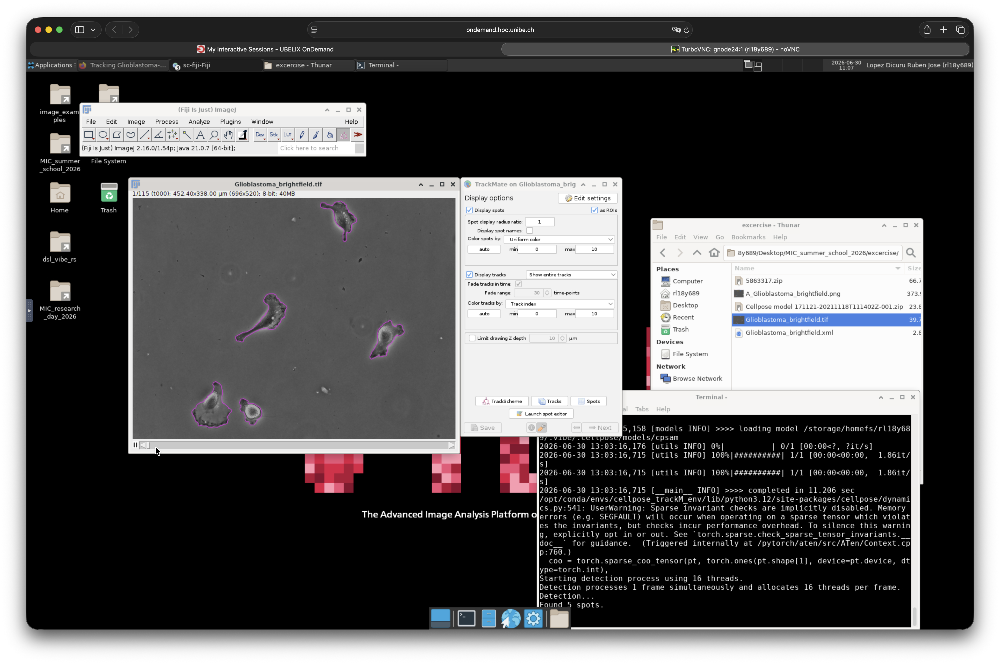

# Cell tracking using TrackMate + Cellpose

## Overview

In this example, we will try to track cells from a challenging dataset. This data sample consist of collective cell migration from Glioblastoma-astrocytoma [^1]. The sample here was imaged using bright-field microscopy and expose complex shape and changes in contrast along the time series. This example is from the TrackMate Fiji Plugin and you can read more about the original workflow [here](https://imagej.net/plugins/TrackMate/detectors/TrackMate-cellpose#tracking-cells-stained-for-cytoplam-with-cellpose).

Our final goal is to successfully segment and track these cells. First we will try to use the default segmentation selector from TrackMate and asses the quality of the segmentation. Then, we will train our custom deep learning model using cellpose and SAM[^2][^3][^4][^5]. Finally we will use oru custom model to run the segmentation step within TrackMate and further run the tracking of the cells.

Let's get started.

## Open and visualize the dataset

### Download the dataset

- Launch your VIBE session.
- Open the browser and download the dataset for this tutorial from zenodo using this [link](https://doi.org/10.5281/zenodo.5863317).
- Create a folder for this project and save your dataset there.
- Try to decompress your dataset using the peaZip utility. You will find it in the VIBE desktop menu under `Applications > VIBE > VIBE Applications > peaZip`.

### Visualize the dataset

- Open the Fiji-TrackMate application via: `Applications > VIBE > VIBE Applications > fiji > fiji (fiji-TrackMate-20260601) [VIBE]`
- Drag and drop the file named `Glioblastoma_brightfield.tif` to the fiji application.
- Explore the image: look at the bit depth, image size, dimensions, etc.

<video controls loop muted autoplay>
 <source src="../assets/videos/preview_glioblastoma.webm" type="video/webm">
</video>

## Running TrackMate on samples

Let's now try to use the default segmentation selector from TrackMate to segment the cells before doing the tracking.

- Launch TrackMate from fiji via `PLugins > Tracking > TrackMate`.
- TrackMate will try to indentify the image metadata. Use the default settings and click next.
- On the select a detector window, use `Cellpose-SAM selector` and click next.
- From the Cellpose-SAM selector window pick the following parameters:

| Setting | Value |
|:--------|:-----:|
| Conda environment | `Cellpose_trackM_env` |
| Pretrained model | `cellpose-SAM` |
| Channels | All channels |
| GPU | Enabled |
| Simplify contours | Enabled |

- Select the first frame and click the `preview` button. You should see the resulting segmentation results by drawings of cells contours as shown bellow. This is the resulting segmentation from this image frame.

- Click the next button. Now the segmentation will run on the full time series and may take a bit of time. Wait until is finished and click the next button again. 
- Let the default values for the "Initial Threshold" window and click next.
- You will land on the "Set filters on spots" window. Here scroll up and down to explore the results of the segmentation for each frame. Can you asses the quality of the segmentation?

While the first results from the segmentation are very good, some frames were not properly segmented. The next task is to pick 3 frames from the series where the segmentation fails and use them to fine tune or retrain the cellpose-SAM (CPSAM) model.

## Pick sample images for training

From the previous step, please select 3 frames where the segmentation was not successfully achieved and save them in a new folder from your project folder as individual images, call this folder "train_dataset".

Hint: Use fiji to accomplish this task.

## Open training images and interact with cellpose

- Launch the cellpose application. Go to `Applications > VIBE > VIBE Applications > cellpose > cellpose (cellpose-gui-4.0.8) [VIBE]`
- Drag and drop one of the images we save in the previous step.
- Get familiar with the application and explore what you can do there. The Help menu is a good place to start.

## Correct annotations and train the custom model

- On the "Segmentation" widget, click on run CPSAM. Is the result of the segmentation better now?
- Try to manually correct the mask that were wrongly segmented. `ctrl + click` will delete labels and `right click` will add new ones. 
- Repeat this step for each training image.
- Once you are satisfied, start the retraining of the model by clicking on: `Model > Train new model with image+mask in folder`. We can leave untouched the default parameters, just change the model name to something you can remember. 
- Click OK and wait a moment until the training is finished. This may take a bit of time. You can see the evolution of the training on the terminal window. The whole process is shown in the video bellow.

<video controls loop muted autoplay>
 <source src="../assets/videos/cellpose_training.webm" type="video/webm">
</video>

## Export model

- The trained model are automatically saved on the same folder as the training. Find your model by the name you saved it with. You will need it for the next step.

## Re-run TrackMate with custom model and asses results

## Export video of tracks

[^1]: Guillaume Jacquemet, Joanna W. Pylvänäinen, & Jean-Yves Tinevez. (2022). Tracking Glioblastoma-astrocytoma cells imaged in brightfield with TrackMate-Cellpose [Data set]. Zenodo. [https://doi.org/10.5281/zenodo.5863317](https://doi.org/10.5281/zenodo.5863317)

[^2]: Pachitariu, M., Rariden, M., & Stringer, C. (2025). Cellpose-SAM: superhuman generalization for cellular segmentation. bioRxiv.

[^3]: Stringer, C., Wang, T., Michaelos, M., & Pachitariu, M. (2021). Cellpose: a generalist algorithm for cellular segmentation. Nature methods, 18(1), 100-106.

[^4]: Pachitariu, M. & Stringer, C. (2022). Cellpose 2.0: how to train your own model. Nature methods, 1-8.

[^5]: Stringer, C. & Pachitariu, M. (2025). Cellpose3: one-click image restoration for improved segmentation. Nature Methods.