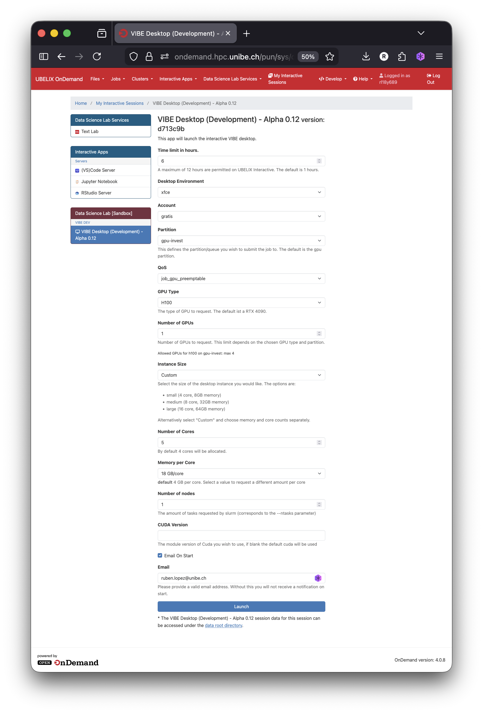

# VIBE system configuration form

## Overview

The VIBE configuration form allows you to customize the features of your VIBE desktop instance, including resource allocation and session duration. 

Here is an explanation of each field you can adjust according to your needs:

* **Time Limit (in hours)**: Define the duration of your session.

* **<s>Desktop Environment</s>**: This option will be removed once issue [#16](https://github.com/dsl-unibe-ch/vibe-desktop-dev/issues/16) in vibe-desktop-dev is resolved.

* **Account**: Choose the appropriate account type based on your usage:

    * **gratis**: Select this option if you are using VIBE desktop for testing purposes with limited resources.
    * **paygo**: You must belong to a project to use this option. For more details, refer to the [Pay-as-you-go (PAYG) Scheme](https://hpc-unibe-ch.github.io/costs/payg/) from UBELIX.
    * **teaching**: Choose this option if you intend to use VIBE desktop for workshops or other teaching activities.

* **Partition**: Currently, ondemand applications can only be run on GPU nodes. Available partitions are:

    * gpu
    * gpu-invest

  For more information on partitions and their usage, refer to the [UBELIX documentation on Partitions](https://hpc-unibe-ch.github.io/runjobs/partitions/#partitions).

* **QoS**: The following Quality of Service (QoS) options are available:

    * job_cpu_premptable
    * job_debug
    * job_gpu_preemptable
    * job_gratis

  Additional details on QoS and their usage can be found in the [UBELIX documentation on QoS](https://hpc-unibe-ch.github.io/runjobs/partitions/#qos).

* **GPU Type**: Choose from the available GPUs listed in VIBE:

    * RTX 3090
    * RTX 4090
    * A100
    * H100
    * H200

* **Instance Size**: Define the amount of resources (CPU cores and RAM) for your session. Three default configurations are available:

    * **Small**: 4 cores, 8GB RAM
    * **Medium**: 32 cores, 32GB RAM
    * **Large**: 16 cores, 64GB RAM
    * **Custom**: Allows you to create a custom hardware configuration for your application.

  For more information on allowed configurations, refer to the [UBELIX documentation on resource selection](https://hpc-unibe-ch.github.io/hardware/gpu/#cpu-memory).

* **Number of Nodes**: Specify the number of nodes required for your computation, if more than one is needed.

* **CUDA Version**: If you are using a version of CUDA other than the default (CUDA/12.6.0) on UBELIX, specify your version here.

* **Email on Start**: If your session is queued for some time, you can provide a valid email address to receive a notification once your session begins.

---

## Note on storage options

VIBE offers by default the same storage capacity offered by UBELIX. Read more on the storage quota and the different storage options from the [UBELIX documentation](https://hpc-unibe-ch.github.io/storage/).
