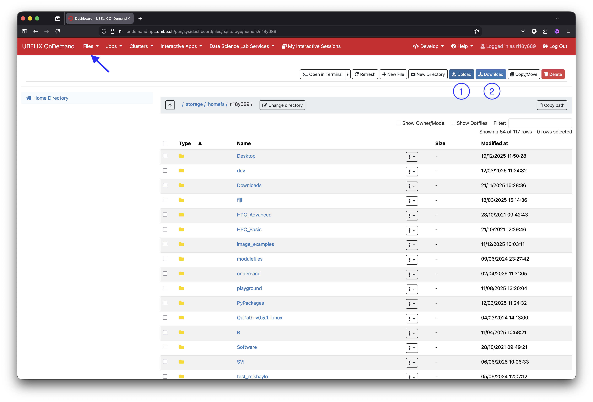

# Overview

This section provides an overview of how data is organized and managed within your VIBE session, as well as how to transfer data to and from your VIBE desktop.

---

## Data Organization

Because VIBE runs on the UBELIX cluster, it uses the same file system and storage structure as UBELIX. This means that your `$HOME` directory, along with all folders and data available in your UBELIX account, is automatically accessible within your VIBE desktop session.

## Quota 

### Standard quota

Your data quota in the VIBE desktop is the same as the one defined by UBELIX. This includes:

- [x] **User `$HOME`**. A user home directory that includes a 1TB storage. It is located under `/storage/home/$USER`, where `$USER` is the campus account. Regular snapshots provide possibility to recover accidentally modified or deleted data.

- [x] **Personal `$SCRATCH`**. A temporary storage space located at `/storage/scratch/user/$USER` with 15TB storage capacity meant for temporary data only with no snapshot and no backup and automatic deletion policy after 30 days.

Please refer to the official [UBELIX documentation](https://hpc-unibe-ch.github.io/storage/) for specific information about the different storage services provided.

### Additional quota

If your project has specific storage requirements, or if you are unsure whether additional storage is needed, please [contact us](../contact.md) or request a [quote](https://intern.unibe.ch/dienstleistungen/informatik/dienstleistungen_der_informatikdienste/dienstleistungen___ressourcen/research_storage/index_ger.html) through the University IT Services website.

!!! note
    We encourage researchers to use the **Research Storage Service** provided by the University. It offers centralized, cost-effective storage with daily backups, as well as seamless connectivity and data transfer between UBELIX and the VIBE environment.

---

## Data Transfer

Data can be transferred to and from your VIBE environment in several ways. Below we describe the recommended options.

---

### Via UBELIX OnDemand

You can use the UBELIX OnDemand web interface to upload and download files.

- Click on **"Files"** in the menu bar at the top left of the UBELIX OnDemand portal (see arrow in the image below).
- Your session’s `$HOME` directory will be displayed along with its contents.
- Use the **"Upload"** button to transfer files from your local computer to any directory within your VIBE session.
- Use the **"Download"** button to copy files from your VIBE session to your local computer.

---

### Via Command Line (Advanced)

If you are comfortable working with the command line, you can transfer data using tools such as `scp` or `rsync`.

Please refer to the official UBELIX [documentation](https://hpc-unibe-ch.github.io/firststeps/movingdata/) for detailed instructions:

---

### Via a Cloud Service

If your data is stored in a cloud service (e.g., OneDrive, Google Drive, Dropbox), you can access it directly from VIBE using the web browser. Launch Firefox from VIBE, find your storage service provider and simply log in with your credentials as you would from any other system and upload or download files as needed.
