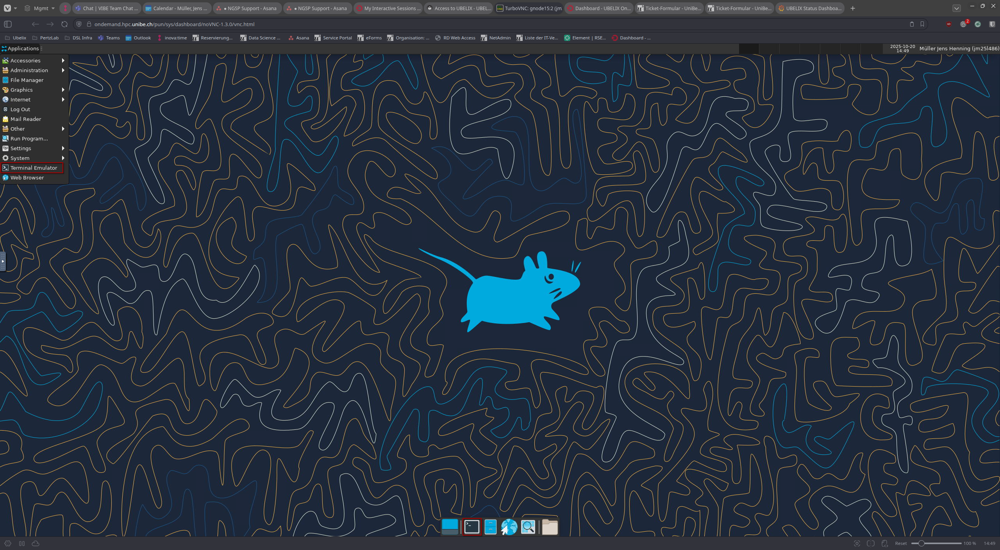

[apptainer-quickstart]: https://apptainer.org/docs/user/main/quick_start.html#interacting-with-images
[apptainer-bind-mounts]: https://apptainer.org/docs/user/main/bind_paths_and_mounts.html#bind-examples

# Launching Applications from the Terminal

You can use the terminal to launch container. This is intended to give advanced users the possibility to:
  * Add custom start parameters
  * Add custom bind mounts
  * Start an archived version of a container

## Opening the Terminal
The VIBE desktop uses the xfce4-terminal by default. You can find the shortcut to open it outlined in the following screenshot:

Alternatively, you can use the [Ctrl] [Alt] [T] keyboard shortcut.

## Manually starting a Container
Since VIBE applications are provided as Apptainer container, you can just run them as described in the [Apptainer Quick Start][apptainer-quickstart].
You can find the location of the container image by looking in the .desktop file with the containers name located in your home directory at .vibe/.local/share/applications/. The image filename is the second value in the 'Exec=' line, it ends on .sif.
If you chose to start a container this way, you'll have to manage the UBELIX modules yourself, if necessary.

The VIBE application containers provide a launcher script for each application they provide, named 'start_<application>.sh' and located in /opt/launchers inside the container filesystem.

## Add custom Start Parameters
You can add additional start parameters for any application by executing the launcher script and adding them afterwards:

apptainer exec /path/to/image.sif /opt/launcher/start_application.sh --custom --parameter

will start the launcher script for <application> and append the '--custom --parameter' to the application command.

## Add custom bind mounts
If you need access to a folder from the UBELIX node which is not available inside the container, you can add your own bind mount options. Please refer to [Apptainer's bind documentation][apptainer-bind-mounts] for more details.
