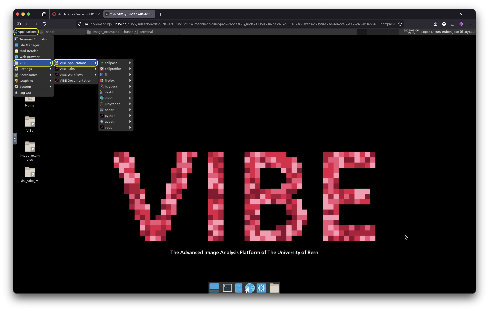
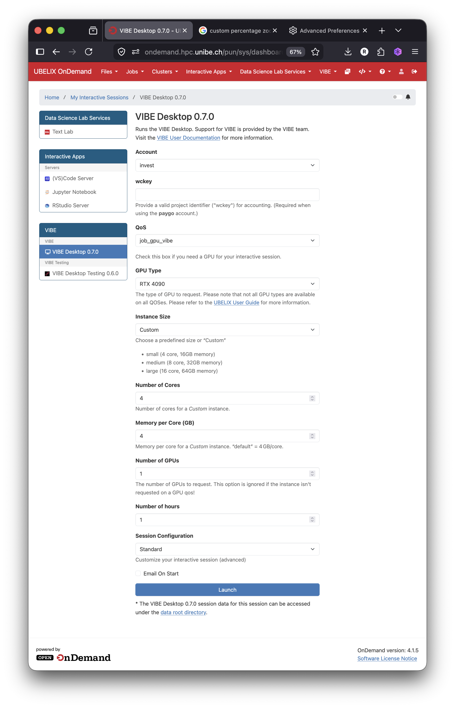

# VIBE system configuration form

## Overview

The VIBE configuration form allows you to customize the features of your VIBE desktop instance, including resource allocation and session duration.

The fields displayed in the form are dynamically generated and the options offered change accordingly on what type of resources are available for the account you choose. That means that not all resources are always available for all type of accounts. For not VIBE users, UBELIX cost and billing scheme applies including the free tiers. Note that free tiers may be use only for testing purpose and it comes with limited resources and support.

<!--  -->

  
  <figcaption> VIBE configuration form.  
  </figcaption>

Here is an explanation of each field you can adjust according to your needs:

### Account
 Choose the appropriate account type based on your use case:

 | Account  | Description | 
 | :------: | :---------: |
 | gratis   | Select this option for testing purposes with limited resources | 
 | invest   | Select this option if you are a VIBE users | 
 | paygo    | Select this option if you own a wc key of an independednt project. You must use your project `wc_key`[^1] | 
 | teaching | Choose this option if you intend to use VIBE desktop for workshops or other teaching activities | 

### wckey

In this filed you can introduce your `wc_key` to launch the VIBE desktop ona Pay-Go basis with your project assigned resources. You must have an UBELIX project `wc_key` to use this option. 

### QoS

Depending on the type of account you selected, different Quality of Service (QoS) options are available. Your QoS options will be displayed automatically as soon as you have picked your account. The VIBE users QoS `job_gpu_vibe` will be assigned automatically upon selection of the `invest` account. The VIBE desktop can run on other QoS, but currently is supported in GPU partitions only, that means that you need to select the correct account and QoS that runs on GPU nodes.

VIBE subscribers have the highest QoS when requesting resources for the virtual the desktop. This mean that VIBE users benefit from the highest priority in allocating dedicated VIBE's project hardware and the shortest  waiting time to launch your session instance. Note that VIBE hardware might be used in another QoS such as the preemptible queue. If this is the case, a minimum idle time of (few minutes) is needed to relocate such resources to your session. 

Additional details on QoS and their usage can be found in the [UBELIX documentation on QoS](https://hpc-unibe-ch.github.io/runjobs/partitions/#qos).

### GPU type

* **Time Limit (in hours)**: Define the duration of your session.

* **<s>Desktop Environment</s>**: This option will be removed once issue [#16](https://github.com/dsl-unibe-ch/vibe-desktop-dev/issues/16) in vibe-desktop-dev is resolved.

* **Partition**: Currently, ondemand applications can only be run on GPU nodes. Available partitions are:

    * gpu
    * gpu-invest

  For more information on partitions and their usage, refer to the [UBELIX documentation on Partitions](https://hpc-unibe-ch.github.io/runjobs/partitions/#partitions).

* **QoS**: The following Quality of Service (QoS) options are available:

    * job_cpu_premptable
    * job_debug
    * job_gpu_preemptable
    * job_gratis

  Additional details on QoS and their usage can be found in the [UBELIX documentation on QoS](https://hpc-unibe-ch.github.io/runjobs/partitions/#qos).

* **GPU Type**: Choose from the available GPUs listed in VIBE:

    * RTX 3090
    * RTX 4090
    * A100
    * H100
    * H200

* **Instance Size**: Define the amount of resources (CPU cores and RAM) for your session. Three default configurations are available:

    * **Small**: 4 cores, 8GB RAM
    * **Medium**: 32 cores, 32GB RAM
    * **Large**: 16 cores, 64GB RAM
    * **Custom**: Allows you to create a custom hardware configuration for your application.

  For more information on allowed configurations, refer to the [UBELIX documentation on resource selection](https://hpc-unibe-ch.github.io/hardware/gpu/#cpu-memory).

* **Number of Nodes**: Specify the number of nodes required for your computation, if more than one is needed.

* **CUDA Version**: If you are using a version of CUDA other than the default (CUDA/12.6.0) on UBELIX, specify your version here.

* **Email on Start**: If your session is queued for some time, you can provide a valid email address to receive a notification once your session begins.

---

## Note on storage options

VIBE offers by default the same storage capacity offered by UBELIX. Read more on the storage quota and the different storage options from the [UBELIX documentation](https://hpc-unibe-ch.github.io/storage/).

[^1]: For more details, refer to the [Pay-as-you-go (PAYG) Scheme](https://hpc-unibe-ch.github.io/costs/payg/) from UBELIX.