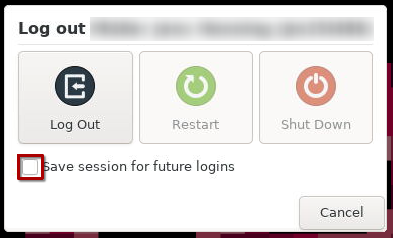

# First Aid

If something is not working as expected, please try the following steps before contacting the VIBE support. First, determine if the issue affects only a specific application or the VIBE Desktop itself. Then, follow the chapters in order.

## VIBE Desktop

This section covers general issues with the VIBE Desktop.

### Restart the VIBE Desktop Session

Restart your VIBE Desktop session to see if the issue persists:

- Click on your username on the top right
- Select 'Log Out' from the menu
- Click the 'Log Out' button

Your desktop session will now terminate in the background. This is complete when your browser shows the 'noVNC' logo. Close the browser tab and switch back to the Open OnDemand window. Your desktop session should show the state 'Completed'. When this is the case, start a new session of the VIBE Desktop and check, if your issue is still there.

### Start a clean VIBE Desktop Session

If restarting the session does not resolve your issue, you can try starting a clean session. Follow the steps above to restart your session, but make sure that the "Save session for future logins" option is disabled (unchecked):

### Remove the user profile for the VIBE Desktop

If the issue still persists, you can try resetting your VIBE Desktop user profile. This is done by deleting the correct folder in your home directory, so the VIBE Desktop will create a new one during the next start.

> [!CAUTION]
> Make sure that you select / delete the correct folder.
> Deleting the profile resets all custom settings of the desktop

- Make sure you have no session of the VIBE Desktop running
- Got to the Open OnDemand interface
- Click on the 'Files' entry in the top left
- Select the 'Home Directory'
- From the list, find the folder named '.vibe' and click on it to open it
- In it, you find the user profiles for each VIBE Desktop stage that you have started in the past:
  - vibe-desktop for the productive Desktop (default)
  - vibe-desktop-demo for the demo version
  - vibe-desktop-test for the testing version
- Select the folder of the VIBE Desktop stage which has the error by ticking the box next to it
- Click on the 'Delete' button on the top right

Now you can start a new session of the VIBE Desktop. This will create a new user profile folder with the default settings. Check if this has solved your issue.

### Contact VIBE Support

If none of the steps above has solved your issue, please get in touch with the VIBE support. Be sure to provide the following information in your request:

- Date & Time the error occured
- The VIBE Desktop version you are using (Name shown in Open OnDemand)
- Session ID of your VIBE Desktop session (can be found on Open OnDemand's 'My Interactive Sessions' list)
- Description what you tried to do that caused the error
- Brief description of what you expected to happen
- Details of what actually happened

To open a request, send the mail to the mail address shown on the Open OnDemand page of the VIBE Desktop.

## Specific Application

If the issue affects only individual applications, the following chapter should help you identify and fix the issue.

### Check the log output

Each application container is run from inside a terminal window to collect its output. The terminal should stay open when an application crash is detected. You can also find messages since the start of the application in it while the application is still running.  
Check the terminal window to see if there is any error / warning message that may indicate the cause of the issue.

### Restart the VIBE Desktop session

It may help to restart the VIBE Desktop session. Follow the instructions above from the 'VIBE Desktop' [Restart the VIBE Desktop Session](#restart-the-vibe-desktop-session) chapter.

### Remove the Applications local files

> [!CAUTION]
> Deleting the local files of the application will most likely revert all configuration of that application to default!

Most applications store user data locally in your home directory. The exact path differs by application. Check the documentation of the application to find the correct path, remove the folder and try again.

### Contact VIBE Support

If none of the steps above has solved your issue, please get in touch with the VIBE support. Be sure to provide the following information in your request:

- Application you have issues with
- Date & Time the error occured
- The VIBE Desktop version you are using (Name shown in Open OnDemand)
- Description what you tried to do that caused the error
- Brief description of what you expected to happen
- Details of what actually happened
- Output of the application in the terminal window if possible

To open a request, send the mail to the mail address shown on the Open OnDemand page of the VIBE Desktop.
